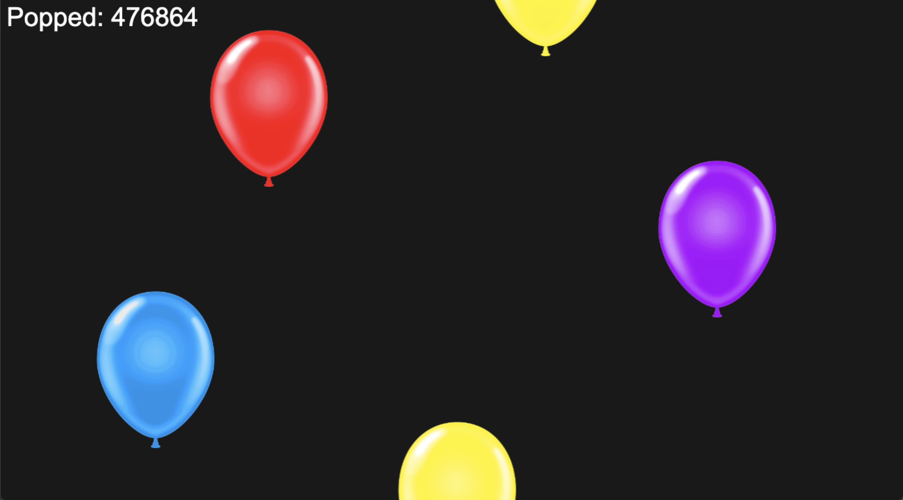

# 🎈 Balloonageddon 2: Revenge of the Latex Legion 🎈

> *The most thrilling, high-stakes balloon-popping experience in gaming history!*  

---

## 📖 **Overview**

The Latex Legion has returned, squeakier, floatier, and more determined than ever to claim the skies as their own! In **Balloonageddon 2: Revenge of the Latex Legion**, the rules are simple, but the stakes have never been higher. Balloons rise relentlessly to the top of the screen. Will you pop them in a chaotic latex explosion, or let them ascend to glory? The fate of... well, nothing really, is entirely in your hands.

---

## 🕹️ **Gameplay Features**
- **🎈 Endless Balloon Assault:** Balloons rise with unstoppable determination! How long can you keep up?
- **💥 Pop or Ignore:** Pop the balloons or let them float—there are no wrong answers here.
- **🎵 Immersive Sound Effects:** A symphony of squeaks and satisfying pops awaits!
- **🌌 Gravity-Defying Physics:** Watch in awe as balloons rise with realistic, totally cutting-edge floatiness.

---

## 🌟 **Why Play?**
- **Heart-Pounding Action:** Your finger is your only weapon in this epic battle of air and rubber.
- **Casual Chaos:** Pop balloons at your own pace. No pressure, no rules, just vibes.  
- **Latex Revenge:** Every balloon you pop strikes a blow against the Latex Legion. Or don’t—see if we care.  

---

## 🚀 **How to Play**
1. Launch the game.
2. Watch balloons rise to the top of the screen.
3. **Optional:** Pop the balloons by clicking on them.
4. **Optional:** Ignore the balloons. Seriously, it doesn’t matter.

---

## 📸 **Screenshots**

---

## Link to start game:
https://fvhreimert.github.io/Balloonageddon-2-Revenge-of-the-Latex-Legion/
